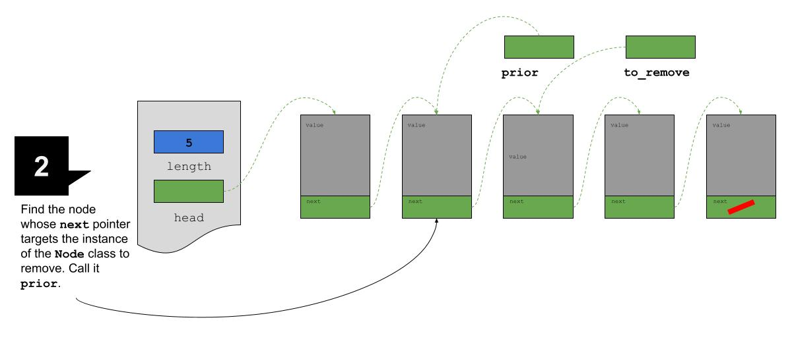

## What's the Point(er)?

In previous editions of the Data Structures Dispatch, we covered a way to use dynamic variables (a dynamically allocated array, in particular) as a way to _implement_ an ADT that stores a set of items that provides operations like _insert_ and _remove_. We used the dynamic array so that its size could be changed at runtime to accommodate an ever-changing quantity of elements.

After exploring different algorithms for implementing such a data structure, we noticed something fishy: When the user wants to insert an element in to the array, there are two possibilities:

1.  There is additional _capacity_ in the array ($size < capacity$);
2.  There is no additional _capacity_ in the array ($size == capacity$).


In case (1), we can add the element to the array using a trivial algorithm. In case (2), however, the algorithm for adding an element is more complicated. It involved, among other steps, adding more space to the array. Amid all the other work that the algorithm took to properly insert an element in the list when there was no spare capacity, the key step was to _allocate additional capacity for the array_. From experience I am sure I don't need to tell you, but allocating memory is very, very expensive.

When the user wants to remove an element from the array, the algorithm we executed was (although slightly complicated) very efficient. Removing an element from the array took a constant number of operations. Very cool! Our gain in efficiency came at a cost, however – the algorithm _never_ released spare capacity back to the operating system.

The figure below illustrates the state of the member variables of an instance of the dynamic array data structure used to implement the dynamically-sized-collection ADT after the elements `3`, `1`, `7`, `4`, `2` `9`, `8`, `6` were added (in that order) and removed (in the reverse order). Note how the item in the `0`th index of the array is `1` and _not_ `3`. Why is that?


Because we chose to implement our deletion operation so that it uses constant time, we end up in a pretty terrible conundrum: We have a situation where the space for all eight items is wasted. Needless to say, this is not ideal. What we need is a data structure that can _implement_ the same ADT (remember, the ADT's data are a set of items and its operations are _insert_ and _remove_).

For that we will turn to the …

## Linked List

As the name implies, a linked list is a data structure that can manage a dynamic number of elements by creating a list of those elements and _linking_ them together. The link between elements is done with pointers. A linked list is built with two cooperating data structures – the linked list itself (mostly just a place to store bookkeeping information) and a node.

The linked-list data structure contains two member variables. The first member variable is a simple integer that the implementer of the linked list will use to keep track of the length of the list. The second member variable is a pointer which we will call _head_. What is the target of the _head_ pointer? We'll return to that in a second.

The node data structure itself also contains two member variables. One of those member variables stores the data that the node holds (its so-called $item$) and the second member variable holds a pointer to the next node in the list (its so-called $next$). It is from this link between two nodes using the _next_ member variable that the linked list gets its name.

To reiterate, the _type_ of the $next$ member variable of a node data structure is a pointer. To be even more explicit and precise, $next$ is a pointer to an object of exactly the same class as itself. The relationship between these types gives rise to the description of a node in a linked list as a _recursive data structure_ because it refers to itself.

We can now resolve the question we left unanswered earlier – what is the target of the $head$ pointer member variable of the linked list data structure? The $head$ pointer is a way for the implementer of the data structure to refer to the first node, or head, of the linked list. The linked-list implementer needs only a pointer to that node in the list (and nothing else!) to be able to implement all the operations necessary for a linked list to support all the operations of the dynamically-sized-collection ADT.

## Linked List Visualized

A conceptual visualization of a linked list might make things easier to understand.


In this example, you can see how the linked list's $length$ member variable holds the length of the list. You can also see how the linked list's $head$ member variable targets the first node in the list which, in turn, points to the second, and so on.

The red slash in the $next$ member variable of the final node in the linked list indicates that the $next$ member variable of that node targets nothing. When we start to write code, the slash will translate to a `nullptr`. The presence of a `nullptr` as the target of the $next$ pointer will be very helpful when we design algorithms for "walking" through a linked list – it will tell us when we should stop walking.

### Linked List Operations Explained and Visualized

Although it is almost always true that a picture is worth a thousand words, for illustrating the implementation of a linked list, it is doubly true!

See the figure below for the steps of inserting a new node at the head of a linked list. As you work through the steps below, notice the types of the variables -- especially the temporary variables that we create/use to point to the node to be inserted into the list.


What good is it to add something if we can't remove it? See the figure below for the steps of removing an existing node from a linked list.


The type of $to\_remove$ is the same as the type of $head$ and $next$ (yes, _each_ $next$) because it accomplishes the exact same goal as those pointers: To, well, point to a node. 



And, again, $prior$ is the same type as $to\_remove$, $head$ and $next$. Now we are getting somewhere!

We need a pointer to the node prior to the one that we are removing (i.e., $prior$) in the removal algorithm but we did _not_ need it in the insertion algorithm. Curious. 

We need a pointer to the node prior to the one that we are removing because it contains a pointer to the to-be-deleted node. If we delete that node (as will be done in the next step) and we do not edit the $next$ pointer in the prior node, then we are going to have a very dangerous situation!


Now that all of the pointers are set up we can do the actual deletion of the node we are excising.


Finally, we adjust the $next$ pointer from $prior$ so that it points to the node after the one that we deleted. Whew. That's a mouthful. Good thing these drawings are here to help.


## Linked List Lessons Learned

With a conceptual understanding of the linked list data structure in our quiver, it is now possible to compare/contrast the linked list implementation of the ADT that has the operations _insert_ and _delete_ with the dynamic array implementation of an ADT with the same operations. 

The most important difference to notice is that the linked-list implementation does not have any wasted spaces for elements that we were created to hold members of the list but then subsequently deleted. That's awesome.

Another difference is that we are allocating a single node at a time when we are inserting data into the list. How is this different that the situation where we implemented the ADT with a dynamic array? Well, in the latter case we were forced to _realloc_ the entire array in order to add a single new element (because all the space had to be contiguous in memory).

In the case where you have a 4875 elements in one of these _insert_/_delete_ ADTs that hold integers, to insert another element in the ADT implemented with a linked-list, only a single allocation would be required. On the other hand, for the ADT implemented with the dynamic array, there would need to be allocation of a contiguous block of space big enough to hold all of the existing items _plus_ the one that you add. Sheesh.

While it seems like the linked list is the way to go, remember that there are some ways that the array-backed implementation really shines. Most importantly, once you know where an element is within the array underlying the the set, you can access it directly using its index. That is most certainly _not_ the case for the linked list.

> We will see an algorithm for accessing elements in a linked list shortly.

## The Nodes and Bolts: The Actual Implementation

Let's put our knowledge to work and actually implement our, until now, conceptual linked list.

### Linked Lists and Nodes -- A Match Made In ...

We will say, perhaps confusingly, that the linked list is implemented as a partnership between two independent data structures: A linked list data structure and a node data structure. I know that's confusing, but when we are talking about a linked list I hope that things will be clear from the context.

The linked list data structure and the node data structure go hand in hand. Neither works as well independently as it does in partnership with the other. A partnership where two data structures work together to implement some higher-level data structure is common. In the future, we will see other data structures that also partner with nodes (albeit with slightly different configuration [e.g., the tree]) but the linked list is a great place to begin understanding how two data structures can work together for a greater good.

The node data structure is the part of the linked-list data structure that contains the elements (i.e., what the list is storing) of the linked list. To accomplish this technical feat, the node data structure consists of two member variables:

1.  The item being stored (`m_item`);
2.  A pointer to the next node in the linked list (`m_next`).

To reiterate what we discovered in the conceptual discussion about linked lists above, `m_next` has the type "pointer to itself" (e.g., pointer to a node data structure). Remember how this self-referential quality led us to define the node as a _recursive data structure_? 

Here's a first crack at the implementation of the node data structure that could be used in the implementation of a linked list of numbers:

```C++
class Node {
public:
  Node() : m_item(), m_next(nullptr) {}
...
private:
  int m_item;
  Node *m_next;
};
```

Something doesn't seem quite right about our `Node`, though.

The node data structure's `m_item` member variable will have a different type depending on the kinds of elements being stored in the linked list, right? A linked list of `int`s means that the node data structure's `m_item` will have an `int` type. On the other hand, a linked list of `char`s means that `Node`'s `m_item` will have a `char` data type. What would be great is if C++ gave us the power to parameterize the definition of `Node` so that we could vary a type on demand ...

Oh wait, it does!! Templates!

The template parameter becomes the means of parameterizing `Node` so that it can be used to store any type of item! A much better declaration/definition of the `Node` class (and the one that we will use going forward) looks like the following:

```C++
template <class ItemType> class Node {
public:
  Node() : m_item(), m_next(nullptr) {}
...
private:
  ItemType m_item;
  Node<ItemType> *m_next;
};
```

The `Node` class is a utility data structure -- it's use is to store data and point to a copy of something that looks exactly like it does, just with different data. 

On the other hand, the linked-list data structure is a bookkeeping tool. It is used to keep track of metadata about the linked list and provide the interface to the linked-list user to modify it, search it, etc. 

As we saw during our conceptual discussion about the linked list (above), an implementation of the linked-list data structure needs some kind of means of referencing its nodes. Because of the way that nodes are linked to one another by their `m_next` member variables, a linked list implementation can eke by with storing only a pointer to the first node in the linked list (and still have the power to access *every* node -- cool!). What is the type of this member variable? Bingo, pointer to `Node`.

Besides a pointer to the head of the linked list of nodes, the linked-list implementation may contain other pieces of metadata that cache the value of commonly accessed properties to make user operations faster. These bits of data are not strictly necessary, but are quite helpful. One of the most frequently accessed properties of a linked list is its size (which could also be called its length). Although a linked list implementation can always _dynamically_ calculate its size, keeping a single member variable to hold the size will save lots of calculation.

Given that discussion, here's a definition/declaration of a `LinkedList` class (without any methods just yet) that implements a linked-list of numbers:

```C++
class LinkedList {
  public:
  LinkedList(): m_head(nullptr), m_length(0) {};
private:
  Node<int> *m_head;
  int m_length
};
```

Good, but not great, right? What is quite unsatisfying about our `LinkedList`? You got it -- we are not fully taking advantage of C++'s generic programming capabilities.

Let's make `LinkedList` itself generic!

```C++
template <typename ItemType>
class LinkedList {
  public:
  LinkedList(): m_head(nullptr), m_length(0) {};
private:
  Node<ItemType> *m_head;
  int m_length
};
```

Notice how the `ItemType` template parameter is used as the type argument to the `Node` data structure! Really neat!

A user of the `LinkedList` class will commonly (but not always!) declare the linked list itself to be an automatic variable. 

```C++

int work_function() {
    LinkedList<int> list{};
    ...
    return 0;
}
```

In other words, the object that is an instance of `LinkedList` (`list` in the example above) will exist on the stack. That is _not_, however, the case for the instances of `Node` that are part of that instance of the `LinkedList` class's linked list.

Here's how the `list` and it's items will exist in computer memory after the user inserts 4 `int`s in the `work_function`:


### The Usual Suspects -- Common Linked List Operations

Remember: The `Node` class is a utility class and the _user_ of the `LinkedList` class is not usually going to interact with that class directly. In fact, the more than we hide it from the end user, the more flexibility we earn if we want to eventually make changes to its definition.

As the implementer of `LinkedList`, though, you will work extensively with instances of the `Node` class so it makes some sense to define member functions on `Node` to make those interactions easier.

The most common way implementers of the `LinkedList` class interact with instances of the `Node` class is by accessing each instance of the `Node` data structure sequentially and in turn. This operation is usually referred to as _walking_ the linked list. Sometimes you will hear the operation referred to as _iterating_ through the nodes in a linked list. _Traversing_ is another common term.

In order to make it easier to implement a walk through the instances of the `Node` class holding the items associated with an instance of a `LinkedList` class, it would make sense to define a few accessor methods in `Node`.

#### `getPointerToNext`
The first, and arguably most important, getter is one that accesses the value of the `Node`'s `m_next` member variable. The name of this member function varies among implementations, but we will call ours `getPointerToNext()`.

The implementation of this member function is straightforward:

```C++
  Node<ItemType> *getPointerToNext() const {
    return m_next;
  }
```

Note that this member function does _not_ change the value of any member variable and is therefore marked as `const`.

####  Using `getPointerToNext`
Let's pretend that

1.  we are implementing some member function of the `LinkedList` class; and
2.  that we have a local member variable named `iterator`; and
3.  `iterator` is pointing to some element in the list of nodes contained in a linked list.

When we call `getPointerToNext()` on that iterator, we get a pointer to the next node in the list.


What value is returned if `iterator` is pointing to the last node in the linked list and we call `getPointerToNext()`? That's right, `nullptr`. We will use this as a sentinel value when walking (traversing or iterating) through the nodes of a linked list.

<hr>

Where were we? Oh yes, we wanted to define an algorithm that will let us "visit" each of the `Node`s holding elements in a linked list. With a `getPointerToNext()` member function, we can easily do just that:

1.  Declare an automatic variable with type "pointer to node" (named, say, `iterator`)
2.  Set `iterator` to `m_head` of an instance of a `LinkedList` class.
3.  While `iterator` is not `nullptr`:
    1.  Set `iterator` to the value of `iterator->getPointerToNext()`

Wow. So cool!

> Note: In the following example we will assume that the instance of the `LinkedList` class whose elements we are walking is an automatic variable (i.e., it is stored on the stack).


The illustration below shows the effect of (3.1) on the first iteration of the loop. The purple arrow represents the action of invoking `getPointerToNext()` on `iterator`.


The illustration below shows the value of `iterator` at the start of the second iteration of the loop.


The illustration below shows the value of the `iterator` on the last iteration of the loop. The return value of `iterator->getPointerToNext()` is `nullptr`. `nullptr` is assigned to `iterator` (3.1) and our loop stops at the next execution of step (3).


### The Tip Of the Linked-List Iceberg

There are many other operations that we would like to be able to perform on linked lists. For instance, we would like to be able to add a node to the list. We would like to be able to remove a node from the list. We will discuss implementing these operations in future Dispatches.

## C++ Sidebar: `.` vs `->`

By now we are very, _very_ familiar with the `.` class member access operator and we are increasingly becoming comfortable with the `->` class member access operator. Although they are both the same thing, it is important to thoroughly understand when to use each one.

Let's first think back to the ubiquitous `.` and make a list of the places that we use it:

1. For accessing the members of an object instantiated from a `struct`.
2. For accessing the public member variables of a `class` (truth be told, declaring member variables of a `class` to be public is not always the best software-engineering decision!).
3. Calling member functions on objects instantiated from `class`es.

What we left unsaid is that the `.` is used to perform these operations _only_ when the objects are automatic -- i.e., allocated on the stack.

Consider a program like

```C++
#include <iostream>

class A {
  public:
    int a;
    void printA() const {
      std::cout << "a: " << a << "\n";
    }
};

struct S {
  int a;
};

int main() {
  A a{};
  S s{1};

  std::cout << "a.a: " << a.a << "\n";
  a.printA();
  std::cout << "s.a: " << s.a << "\n";

  return 0;
}
```
[See it live](https://godbolt.org/z/cYTGjT6K9)

`a` and `s` are both automatic variables. Therefore, it is correct to use the `.` in order to access their member variables and call their member functions.

Let's take a brief digression into the world of board games. There is a game called [Chutes and Ladders](https://en.wikipedia.org/wiki/Snakes_and_ladders). In the game, if your piece lands on a space where there is a ladder, your piece climbs the ladder and makes a quick advance up the board. If your piece lands on a space where there is a chute, your piece will slide down the chute and you lose hard-won progress. When I was a kid playing the game and I landed on a space with either a chute or a ladder, I always liked to think that it look a little extra shove for my piece to go up the ladder or down the chute once it landed on the square.

How does that relate to C++?

Consider an automatic variable named `ptr_to_int` declared and initialized like

```C++
  int *ptr_to_int = new int{0};
```
As a result of that declaration and initialization, part of the memory space of our program might look like this:


Think about `ptr_to_int` as a spot on the Chutes and Ladders gameboard connected to either a chute or a ladder. A `*` before the `ptr_to_int` is like pushing our game token up the ladder or down the chute and the ultimate destination is the target of the pointer. Using a `*` is called _dereferencing_ a pointer. Dereferencing a pointer is a very important operation in C++ to understand.

To change the value in the green box pointed to by the purple arrow, we use the `*` as in

```C++
  *ptr_to_int = 5;
```


On the other hand, to change the target of the pointer itself (i.e., where the ladder or chute leads), we omit the `*` as in

```C++
  ptr_to_int = new int{2};
```


Why the discussion of the `*` when we were supposed to be talking about the `->`? Because they are fundamentally equivalent.

In short, when we are dealing with dynamic (as opposed to automatic) variables that are instances of `struct`s and `class`es, use the `->` instead of the `.` we used when those were automatic variables. For instance,

```C++
#include <iostream>

class A {
  public:
    int a;
    void printA() const {
      std::cout << "a: " << a << "\n";
    }
};

struct S {
  int a;
};

int main() {
  A *a = new A{};
  S *s = new S{1};

  std::cout << "a->a: " << a->a << "\n";
  a->printA();
  std::cout << "s->a: " << s->a << "\n";

  return 0;
}
```
[See it live](https://godbolt.org/z/e7h3r75M4)

For those who want to go a little deeper, the `->` is equivalent to first dereferencing the pointer to the instance of `struct` or `class` allocated on the heap and then using the `.`.

In other words, we could rewrite the program above like

```C++
#include <iostream>

class A {
  public:
    int a;
    void printA() const {
      std::cout << "a: " << a << "\n";
    }
};

struct S {
  int a;
};

int main() {
  A *a = new A{};
  S *s = new S{1};

  std::cout << "(*a).a: " << (*a).a << "\n";
  (*a).printA();
  std::cout << "(*s).a: " << (*s).a << "\n";

  return 0;
}
```
[See it live](https://godbolt.org/z/vx9PWs9h1)

and get exactly the same result.

Please note: the `(*`...`).`... syntax is rarely used in production code and shown here only to highlight the fundamental similarity between the `->`, the `.` and the `*`.