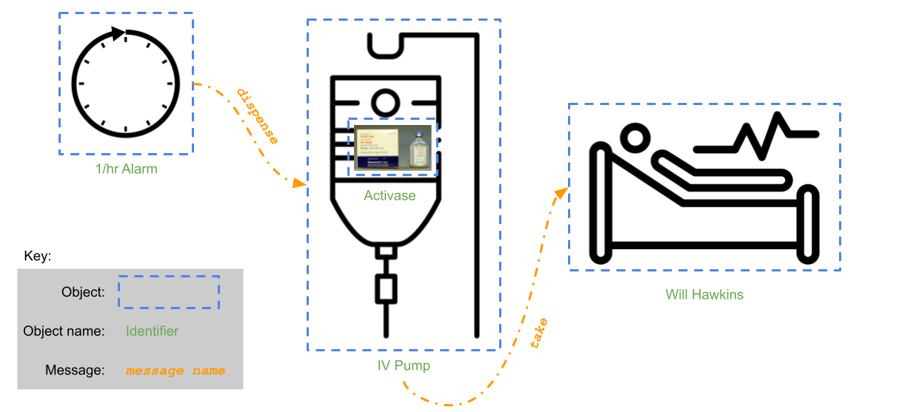

After (most) classes this semester, I will publish an edition of the _Data Structures Dispatch_, a paper devoted to covering ["all the news that’s fit to print"](https://en.wikipedia.org/wiki/The_New_York_Times#Slogan) about _the_ pre-eminent data structures class available at UC.[^only]

[^only]: Please note: That might not be that great of a feat because it might be the _only_ one at UC. Nevertheless ...

### What is Computer Science?

If we are going to be computer scientists, it might be good to actually determine what the sweet science entails? In our class discussion we came up with some excellent answers:

1. The study of computers and how they work.
1. Solving problems with algorithms and computers.
1. Using logic to understand how computers work.

Each of those answers is excellent. For reference, here is the definition of computer science according to [Wikipedia](https://en.wikipedia.org/wiki/Computer_science): "Computer science is the study of computation, automation, and information."

For the purposes of our work this semester, we’ll say that _computer science_ is the discipline of solving problems with computers.

Intuitively we know a problem when we see one. But, it’s not entirely obvious what we have in mind when we say "solution."

### Problem Solutions Using Computing

One way to solve a problem using a computer is to write an application. For instance, in the not-so-distance past, people noticed that there was a problem reliably hailing cabs and so they wrote a program named Uber. Others noted that there was a problem with getting groceries delivered from Kroger and so they built Instacart. In fact, the UNIX operating system (the spiritual ancestor of the Linux operating system, the one we will be using in this course) was written to solve a problem – [typesetting technical reports](https://www.bell-labs.com/usr/dmr/www/hist.html) (at least that’s what they told the bosses who were paying the designer's salaries!).

In this course we are interested in a specific method of design and analysis of solutions to problems -- object-oriented design and analysis. Once we have the conceptual framework for a solution thanks to our object-oriented design and analysis, we will write programs to implement that solution. It should come as no surprise that we will implement our solutions using an object-oriented programming (OOP) language. In particular, we are going to use C++.

OOP is one of four (in most expert's analysis) programming paradigms, or styles. (If you are wondering, the other three are procedural, functional and logical. I encourage you to take CS3003 if you are interested in those!) The inventor of C++ says that object-oriented programming is about "the idea of organizing types into hierarchies to express their relationships."[^bjarne] Yes, but that’s a mouthful. Is there another definition? The C++ book that some of you used last semester defines it like this: "Object-oriented programming is centered around the object. Objects are created from abstract data types that encapsulate data and functions together."[^gaddis] That, too, is a mouthful. However, it has the benefit of being a definition that we can gradually comprehend throughout the semester by understanding one word at a time.

[^bjarne]: Bjarne Stroustrup. Programming : Principles and Practice Using C++. Upper Saddle River, Nj, Addison-Wesley, 2014.

[^gaddis]: Gaddis, Tony. Starting out with C++. From Control Structures through Objects. Boston, Pearson Education, Inc, 2017.

So, if we are writing programs in OOP _and_ a solution to a problem is a program, then our solutions are going to be programs written in an object-oriented way. You might even call them object-oriented solutions.

### Object-oriented Solutions

An object-oriented solution to a problem is a program consisting of an interacting set of objects.[^walls] There’s that word again ... objects. And, what does it mean for them to interact? Let’s flesh that out with an example.

[^walls]: Carrano, F. M., & Henry, T. (2025). Secure Data Structures and Algorithms with C++ (8th ed.). Pearson.

_The problem_: It’s hard to remember when to give patients their medicine. In particular, it’s hard to remember to dispense Activase (a stroke-recovery medicine) once-an-hour through an IV pump attached to a sick patient. The solution is a system that automatically dispenses Activase to the patient exactly once an hour through an IV pump.

What objects exist in this solution? There’s _Will Hawkins_. He’s an object, right? There’s an _IV pump_ to dispense the medicine. There’s _Activase_, what is being dispensed from the _IV pump_. Then there’s an alarm clock that goes off once an hour – we will call that a _1/hr schedule_. All in all, I count four different objects.

Each one of those objects has characteristics, or attributes. For instance, _Will Hawkins_ has a height, birthdate, list of allergies to drugs, prior medical conditions, and so on. _Activase_ has a dose, a chemical signature, a price, etc. _IV pump_ has a manufacturer, a power source, etc. I think you get the idea.

In our solution, the _1/hr schedule_ object sends a _message_ to the IV object to tell the IV that it's time to dispense Will’s Activase. One of the characteristics _encapsulated_[^future] in the _1/hr schedule_ object is the rate at which it sends messages. By the name we have given the object, it makes sense that it sends messages one time per hour. But what message does it send to the _IV Pump_? "dispense"!

In turn, after the _IV pump_ pulls the proper dose from its collection of Activase, the _IV pump_ tells _Will_ to, effectively, "take" the Activase. Obviously I have no choice – just look at me lying in that bed.

[^future]: _Encapsulation_ is one of the four hallmarks of object-oriented programming. We will learn more about it very soon. I mean, _very_ soon!

Whether or not you can tell, we have described a complete solution to the problem in terms of interacting objects. Will, the IV pump, the Activase and the 1/hr schedule are the objects. Those objects are interacting by sending messages and those messages represent the interface of an object. An object specifies its interface which is the stable, reliable, durable means for other objects to interact with it. See [below](#object-oriented-solutions-in-code) for why that is important.

_Objects_ are the _fundamental_ substance in object-oriented programming.  Although certain object-oriented programming languages have the related concept of classes, objects are the real currency of object-oriented programming and there are certain OOP languages (e.g., JavaScript) that do not have (or did not have when they were first proposed[^javascript-classes]) the idea of classes. In other words, classes are _not_ a prerequisite for object-oriented programming. 

[^javascript-classes]: Classes, per se, were not added to ECMAScript (what is colloquially known as JavaScript) until the [$6^{th}$ edition](https://tc39.es/ecma262/#sec-intro).

But, you cannot have object-oriented programming without objects! Just remember that!

### Object-oriented Solutions In Code

I think that we have discussed objects enough to say something more formal about them: objects _encapsulate_ behavior (operations) and attributes (data) and allow interaction only through fully specified _interfaces_. By directing interactions among objects through interfaces, the encapsulation of inner details helps improve software reusability and extensibility. _Users_ of objects rely only on the interfaces (and their stability) and do not rely on the the details, which leaves the developers implementing the object free to:

1. Change how characteristics are stored (or calculated);
1. Update how behaviors are implemented;
1. Keep track of additional characteristics in order to
1. add functionality.

And that is _just_ the beginning!

As a user of the object, you do not have to know anything about how those actions are performed or the characteristics are stored. You are only concerned that the actions work as advertised and that the characteristics exist.
2.  the messages sent between objects are implemented in C++ as _member functions_ (which are the object's behaviors).
3.  the characteristics (or attributes) are implemented in C++ as _member variables_.